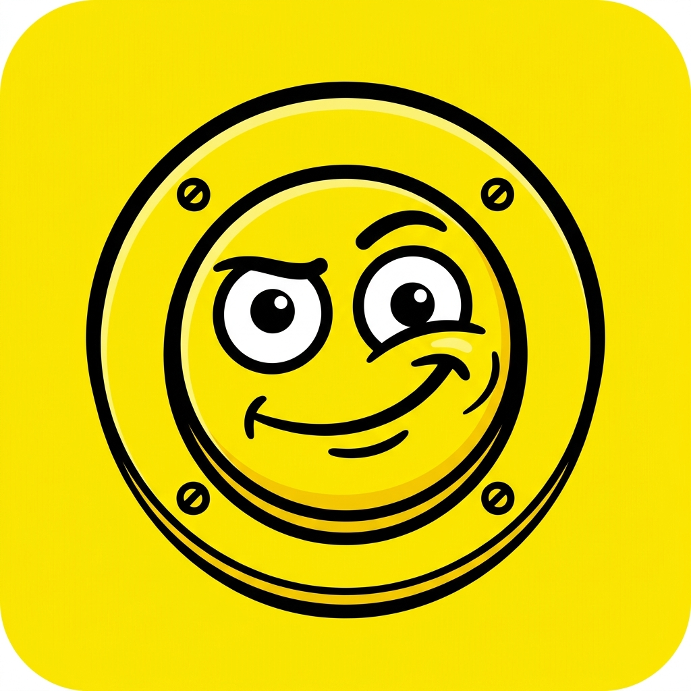
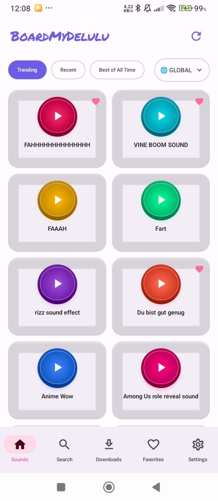
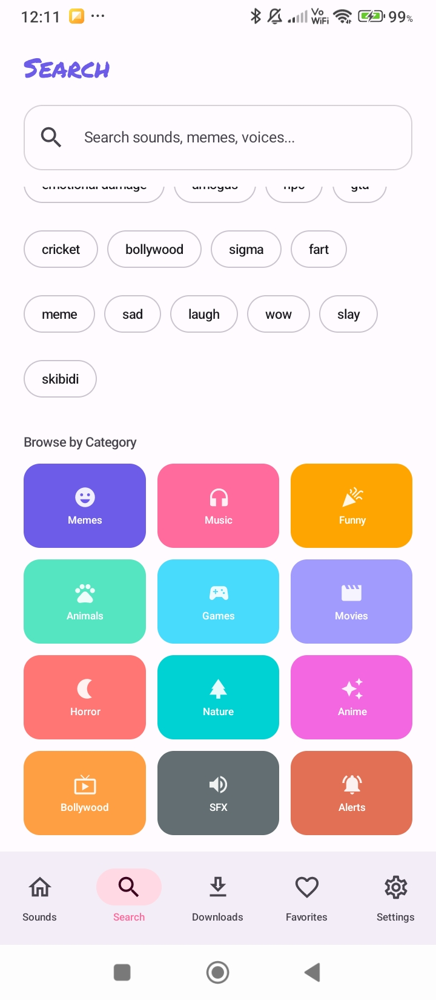
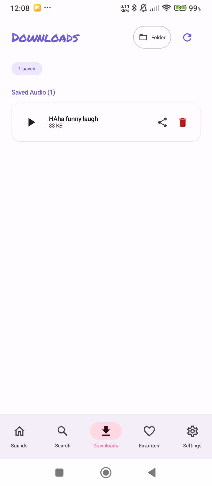
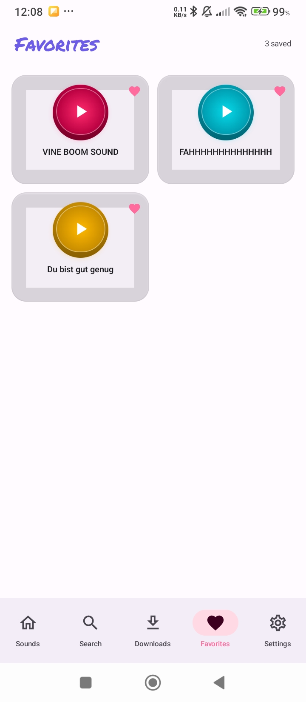
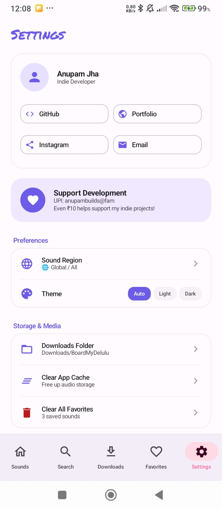
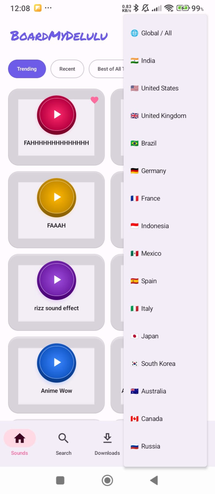

  

<h1 align="center">BoardMyDelulu</h1>

  <strong>The only soundboard app you need. Instant viral Indian and global meme audio pads with zero bullshit and zero ads.</strong>

  
  
  
  

  
  
  
  
  
  

---

## Overview

Ever been in a voice call, discord server, or group chat and wished you had the exact viral meme sound effect at your fingertips right at that second?

BoardMyDelulu brings millions of trending sound effects, meme punchlines, anime audio, and gaming soundboards directly to your phone in tactile 3D buttons. Powered by a custom live sound engine with zero ads and zero bloat.

---

## Desktop Version for Windows PC

Looking for the desktop PC soundboard with global hotkeys, physical/virtual audio device routing, and background meme deck shuffle?
Check out the official Windows software: [BoardMyDelulu PC](https://github.com/tech-anupam/BoardMyDelulu-PC).

---

## Highlights

- Tactile 3D push-button sound pads with live waveform pulsation and haptic feedback
- India and Worldwide viral sound feeds with instant country switching
- Fast multi-source sound engine connecting to the largest audio catalogs
- Dedicated category explorer with custom icons for Memes, Music, Gaming, Anime, Bollywood, and SFX
- Built-in Chrome-style offline download manager with background progress tracking
- Instant audio playback directly inside the downloads tab
- Direct MP3 file sharing for WhatsApp, Discord, and Telegram
- Text link sharing for Instagram Direct Messages, Stories, and social apps
- Personalized favorites collection with quick one-tap toggling
- Zero advertisements, zero bloat, handwritten Google typography, and full dark theme support

---

## Installation

1. Download the latest APK from the [Releases](https://github.com/tech-anupam/BoardMyDelulu/releases) tab
2. Open the file on your Android device and confirm installation
3. Enjoy millions of instant soundboards

---

## Support Indie Development

BoardMyDelulu is independently built by Anupam Jha.

- UPI ID: anupambuilds@fam
- Direct Support: Even 10 INR helps keep servers running and supports continuous indie development

---

## Connect

- GitHub: [@tech-anupam](https://github.com/tech-anupam)
- Portfolio: [anupambuilds.store](https://anupambuilds.store/about)
- Instagram: [@tech.anupam](https://instagram.com/tech.anupam)
- Email: [killerboy99126@gmail.com](mailto:killerboy99126@gmail.com)

---

## License

This project is licensed under the [MIT License](LICENSE).

---

## Keywords

soundboard, android soundboard, meme soundboard, viral audio, sound effects, meme sounds, troll soundboard, discord soundboard, whatsapp audio, anime sounds, gaming sfx, bollywood memes, ad-free soundboard, kotlin, android app, jetpack compose, open source android app
